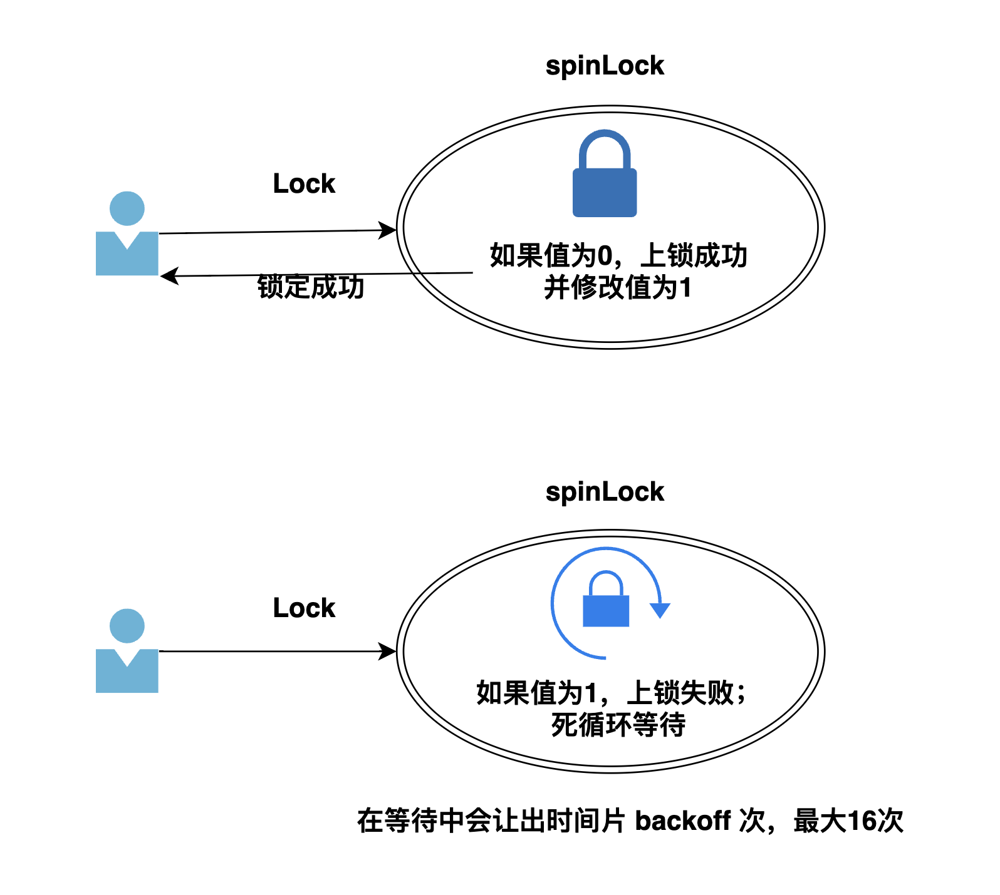

# Go协程池


解决的问题：

- 当需要创建大量的`goroutine`的时候，如果不限定`goroutine`的数量，将是对程序的巨大灾难
- 使用完的`goroutinue`可以复用继续执行下一个任务（而不是立即销毁），如果每次都是创建新`goroutinue`执行任务，频繁的创建销毁`goroutinue`导致利用率低下

## 逻辑图


## 代码解析
整个代码只有500行，简单易学

#### 定义协程池结构体


```go
/*
Pool：用来管理协程对象 *goWorker
*/
type Pool struct {
	// 协程对象最大个数
	capactiy int32
	// 活跃的协程对象个数
	running atomic.Int32

	// 阻塞模式
	waiting atomic.Int32 // 阻塞等待的数量
	cond    *sync.Cond

	// Pool是否关闭
	closed chan struct{}
	// 配置信息
	option *Options

	// 回收对象
	victim sync.Pool
	// 操作local对象的锁
	lock sync.Locker
	// 协程对象缓存
	local goWorkerCache

	// 判断goPurge是否已经结束
	purgeDone int32
	// 等待协程对象停止（包括协程池 和用户协程）
	allRunning *wait.Wait
}

```
- capacity: -1 表示不限制协程中协程数量
- waiting：表示等待协程池中有空闲的协程对象前，外部阻塞的协程数量（阻塞模式的时候，才会操作该值）
- cond： 条件变量，用于阻塞等待协程池中协程对象
- victim：表示释放的协程对象
- lock: 目的在于操作`local`前上锁，因为`local`不是并发安全的
- local：表示缓存的协程对象
- allRunning：为了实现关闭时的超时等待，对执行的协程计数（包括：协程池中的协程 和 外部的调用协程）

#### 构建协程池对象

```go
// capacity: -1表示不限定 >0表示最大的协程个数
func NewPool(capacity int32, opts ...Option) *Pool {

	option := new(Options)
	for _, opt := range opts {
		opt(option)
	}

	//如果启用清理，清理间隔的值需要 >0
	if !option.DisablePurge {
		if option.MaxIdleTime <= 0 {
			option.MaxIdleTime = maxIdleTime
		}
	}

	// 日志打印器
	if option.Logger == nil {
		option.Logger = defaultLogger
	}

	p := Pool{
		capactiy:   capacity,
		closed:     make(chan struct{}),
		lock:       syncx.NewSpinLock(),
		option:     option,
		allRunning: &wait.Wait{},
		local:      newCacheStack(),
	}

	p.victim.New = func() any {
		return newGoWorker(&p)
	}
	p.cond = sync.NewCond(p.lock)

	go p.goPurge()
	return &p
}

```

- `option *Options` 是可选的配置项

```go
type Options struct {

	// 禁用清理
	DisablePurge bool

	// 协程池中的协程如果长时间不执行任务 超过 MaxIdleTime 就会被清理掉
	MaxIdleTime time.Duration

	// NonBlocking = true非阻塞模式
	// NonBlocking = false 阻塞模式，下面的MaxBlockingTasks参数才有作用
	NonBlocking bool

	// 阻塞模式：当NonBlocking=false的时候，最多阻塞的协程数 MaxBlockingTasks， MaxBlockingTasks = 0表示可以无限阻塞
	MaxBlockingTasks int32

	// 日志打印器
	Logger Logger

	// 协程panic的时候调用
	PanicHandler func(any)
}

```

-  `lock` 是自定义实现的轻量自旋锁

```go
// spinlock 本质就是一个uint32的正整数
type spinLock uint32

const maxBackoff = 16

func (sl *spinLock) Lock() {
	backoff := 1
	for !atomic.CompareAndSwapUint32((*uint32)(sl), 0, 1) {
		// 这个的意思就是暂时让出时间片 1次 2次 4次 8次 16次，backoff 数值越大，让出的时间片的次数也就越多(最大为16)
		for i := 0; i < backoff; i++ {
			runtime.Gosched()
		}
		if backoff < maxBackoff {
			backoff <<= 1 // backoff *= 2
		}
	}
}

// 修改为0
func (sl *spinLock) Unlock() {
	atomic.StoreUint32((*uint32)(sl), 0)
}

// 自旋锁
func NewSpinLock() sync.Locker {
	return new(spinLock)
}

```




#### 向协程池提交任务

- 检测协程池是否已经关闭 `p.IsClosed()`
- 核心函数` p.getGoWorker()`获取一个协程对象执行 `task TaskFunc`


```go
// 外部提交任务
func (p *Pool) Submit(task TaskFunc) error {

	if p.IsClosed() {
		return ErrPoolClosed
	}

	w, err := p.getGoWorker()
	if err != nil {
		return err
	}
	w.exec(task)
	return nil
}
```
- 在 `getGoWorker()`函数内部
- 先上锁保证操作 `local`的并发安全
- 从`local`中获取一个协程对象
- 如果没有获取到，正在运行的协程对象数量没有超过容量`capacity`的前提下，创建新的协程对象
- 如果都没有成功，在阻塞模式下，外部的调用`Submit`的协程就会被阻塞在`p.cond.Wait()`，等待空闲协程对象
- 如果是非阻塞模式，直接返回`ErrPoolOverload`超载错误

```go
func (p *Pool) getGoWorker() (*goWorker, error) {
	// 上锁（避免并发问题）
	p.allRunning.Add(1)
	p.lock.Lock()
	defer func() {
		p.lock.Unlock()
		p.allRunning.Add(-1)
	}()

	for {

		if p.IsClosed() {
			return nil, ErrPoolClosed
		}

		// 1.从local缓冲中获取
		if w := p.local.detach(); w != nil {
			return w, nil
		}

		// 2. 从victim中获取（新建一个）
		if p.Cap() == -1 || p.Cap() > p.running.Load() { // 说明还有容量
			raw := p.victim.Get()
			w, ok := raw.(*goWorker)
			if !ok {
				return nil, errors.New("victim cache data is wrong type")
			}
			w.start()
			return w, nil
		}

		//3. 执行到这里，说明没有空闲的协程对象
		//  非阻塞模式 or 阻塞模式（但是阻塞的太多了）
		if p.option.NonBlocking || (p.option.MaxBlockingTasks != 0 && p.Waiting() >= p.option.MaxBlockingTasks) {
			return nil, ErrPoolOverload
		}

		//4. 阻塞等待
		p.waiting.Add(1)
		p.cond.Wait() // 这里会对p.lock解锁，然后阻塞等待；被唤醒后，又对p.lock上锁
		p.waiting.Add(-1)
	}

}
```


这里额外说一点：`p.cond.Wait() `：
在`getGoWorker() `函数入口处，我们执行了 `p.lock.Lock()`函数，只有在 `getGoWorker`退出的时候，才会释放锁`p.lock.Unlock()`。

那一旦阻塞，导致锁没有释放，其他的协程调用`getGoWorker() `函数，不就直接阻塞在 `p.lock.Lock()`处了，而不是 `p.cond.Wait()`？？？

这个要看下`p.cond.Wait()`的内部代码

```go

// NewCond returns a new Cond with Locker l.
func NewCond(l Locker) *Cond {
	return &Cond{L: l}
}

func (c *Cond) Wait() {
	c.checker.check()
	t := runtime_notifyListAdd(&c.notify)
	c.L.Unlock()
	runtime_notifyListWait(&c.notify, t)
	c.L.Lock()
}
```
可以看到内部有对 `c.L.Unlock`锁解锁，`runtime_notifyListWait(&c.notify, t)`阻塞等待，当有信号以后，会执行`c.L.Lock()`再上锁。所以在`p.cond.Wait()`的时候，**【锁其实处于解锁的状态】**。

Ps:
`c.L ` 变量的赋值在 `p.cond = sync.NewCond(p.lock)`


#### 用协程对象执行任务

- 获取到协程对象后，就要开始执行任务了`w.exec(task)`。
其实这里用到了**生产者消费者模型**，执行任务就是`gw.taskChan <- task`,将`task`保存到`chan`中（生产者）.

- 在 `goWorker`协程对象的`start`函数会启动一个 `goroutine`，监视`gw.taskChan`的任务（消费者）
- 任务执行完成以后，会将当前的 `goWorker`协程对象，归还到`local`中，等待其他的调度；如果任务执行中出现了`panic` or `local`已满，则会将`goWorker`协程对象，放入到`victim`中


```go
type TaskFunc func()

type goWorker struct {
	taskChan chan TaskFunc
	pool     *Pool

	// 最后一次使用的时间
	lastUsedTime time.Time
}

func newGoWorker(pool *Pool) *goWorker {
	gw := goWorker{}
	gw.pool = pool
	gw.taskChan = make(chan TaskFunc)
	return &gw
}

// 启动协程（1.等待任务 2.任务处理完成，自动回收到local中）
func (gw *goWorker) start() {
	gw.pool.running.Add(1)
	gw.pool.allRunning.Add(1)
	go func() {
		defer func() {
			gw.pool.running.Add(-1)
			gw.pool.allRunning.Add(-1)
			gw.pool.victim.Put(gw) // 执行失败，回收到victim中

			if p := recover(); p != nil {
				handler := gw.pool.option.PanicHandler
				if handler != nil {
					handler(p)
				} else {
					gw.pool.option.Logger.Printf("*goWorker panic err:%+v\n stack info: %s\n", p, debug.Stack())
				}
			}
			gw.pool.cond.Signal()
		}()

		for task := range gw.taskChan { // 阻塞等待任务
			if task == nil {
				return
			}
			task()
			// 执行成功，自动回收到local中
			if !gw.pool.recycle(gw) {
				return
			}
		}
	}()
}

func (gw *goWorker) stop() {
	gw.taskChan <- nil
}

func (gw *goWorker) exec(task TaskFunc) {
	gw.taskChan <- task
}

```


#### 动态调整协程对象数量

调整后，记得发送`p.cond.Broadcast()`唤醒阻塞等待的任务
```go

// 调整容量
func (p *Pool) Tune(capacity int32) {
	oldCap := p.Cap()
	if capacity < 0 {
		capacity = -1
	}
	if oldCap == capacity {
		return
	}

	atomic.StoreInt32(&p.capactiy, capacity)

	if p.Cap() < 0 { // 调整为无限容量
		p.cond.Broadcast()
		return
	}

	// 调整的容量大于之前的容量（说明有更多的空闲）
	if oldCap > 0 && p.Cap() > oldCap {
		p.cond.Broadcast()
	}
}
```


#### 关闭协程池
分为**阻塞关闭** 和 **阻塞超时关闭**
allRunning:表示 【协程池中的协程】 + 【阻塞等待中的用户协程】

```go
func (p *Pool) Close() {
	close(p.closed)

	p.lock.Lock()
	p.local.reset()
	p.lock.Unlock()
	p.cond.Broadcast()

	p.allRunning.Wait()
}

func (p *Pool) CloseWithTimeOut(timeout time.Duration) error {
	close(p.closed)

	p.lock.Lock()
	p.local.reset()
	p.lock.Unlock()
	p.cond.Broadcast()

	p.allRunning.WaitWithTimeOut(timeout)

	if p.Running() != 0 || p.Waiting() != 0 || (!p.option.DisablePurge && atomic.LoadInt32(&p.purgeDone) == 0) {
		return ErrTimeout
	}
	return nil
}

```

这里我们自己实现了一个`WaitGroup`，拥有超时等待的功能

```go
/*
对系统 WaitGroup的封装
*/
type Wait struct {
	wait sync.WaitGroup
}

func (w *Wait) Add(delta int) {
	w.wait.Add(delta)
}

func (w *Wait) Done() {
	w.wait.Done()
}

func (w *Wait) Wait() {
	w.wait.Wait()
}

// 超时等待
func (w *Wait) WaitWithTimeOut(timeout time.Duration) bool {

	ch := make(chan struct{})
	go func() {
		defer close(ch)
		w.Wait()
	}()

	select {
	case <-ch:
		return false // 正常
	case <-time.After(timeout):
		return true // 超时
	}
}

```